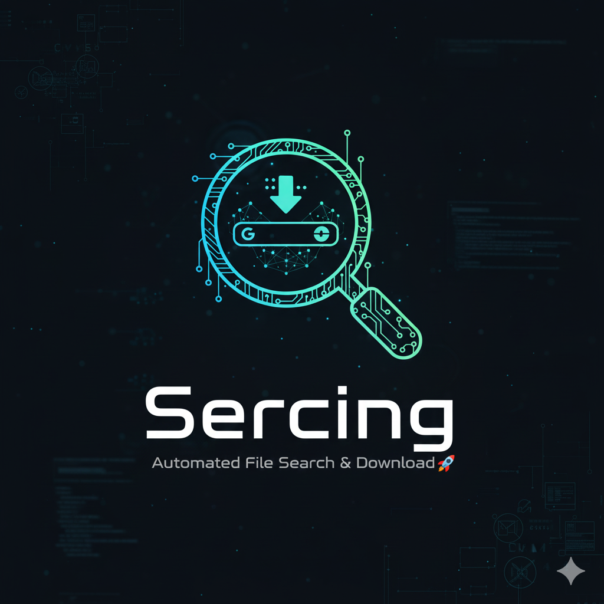

# 🔍 Automated File Search & Download Tool

Welcome to Automated File Search & Download Tool! 🚀 This program is your go-to solution for searching and downloading specific files from a given domain, all powered by the awesome capabilities of Google Dorking via SerpAPI. Say goodbye to manual file searches, and let automation do the heavy lifting for you! 💪



---

## 🌟 Features

**Search Files Using Dorking**: Input a domain and use dorking techniques to find specific file types like PDFs, DOCXs, ZIPs, and more.

**Utilizes SerpAPI for Accuracy**: Leverages Google Search through SerpAPI for fast and reliable results.

**Download Files Directly**: Choose the file you want from the search results and download it to your specified folder.

**User-Friendly Interface**: Includes ASCII art and a step-by-step guide to ensure an easy and enjoyable user experience.

---

## 🎉 Getting Started

Follow the steps below to set up and run the program on your local machine:

**Prerequisites**

Python 3.x

**SerpAPI API Key**: This is required to use Google Search capabilities. You can get an API key by signing up at SerpAPI.

**Installation**

1. Clone this repository to your local machine:

```bash
git clone https://github.com/Kentox493/Sercing.git
cd Sercing
```
2. Install the required dependencies using pip:

```bash
pip install -r requirements.txt
```
The dependencies include:

> requests: To handle HTTP requests.

**Setting Up SerpAPI**

To use this tool, you need an API key from SerpAPI:

1. Go to https://serpapi.com/ 

2. Sign up and obtain your API key.

3. You'll need this key when running the program.

**Running the Program**

Run the script using Python:
```bash
python sercing.py
```
When prompted, follow these steps:

1. **Enter the domain** you want to search files from (e.g., example.com).

2. **Enter the file extensions** you want to search for (e.g., pdf, docx). You can leave it blank to search for all common file types.

3. **Enter the folder** where you want to save the downloaded files.

4. **Enter your SerpAPI API key.**

The program will then use Google Dorking to search for files matching your criteria and display the results, allowing you to select which files to download. 🚀

**Example Usage**
                                                      
## Automated File Search & Download Tool

- 🌐 Masukkan nama domain (contoh: example.com): example.com
- 📂 Masukkan ekstensi file yang ingin dicari (contoh: pdf, docx, kosongkan untuk semua): pdf, docx
- 💾 Masukkan folder untuk menyimpan file: downloads
- 🔑 Masukkan API key SerpAPI Anda: YOUR_API_KEY

- 🔍 Proses pencarian sedang berlangsung...
- 📄 File yang ditemukan:
  
> 1. report.pdf
> 2. summary.docx

- 📝 Masukkan nomor file yang ingin diunduh (1-2), atau 0 untuk membatalkan: 1
- ✅ File 'report.pdf' berhasil diunduh ke 'downloads/report.pdf'

---

## 📂 File Structure

- **sercing.py**: The main script that performs the file search and download.
- **requirements.txt**: Lists the required dependencies for the project.

---

## 📚 How It Works

**Search Using Dorking**: The script uses Google Dorking techniques to find files in the given domain.

**SerpAPI Integration**: All searches are powered by the SerpAPI service, which allows for accurate and efficient Google searches.

**Download Manager**: Users can select specific files to download from the list of search results.

---

## 🛠 Troubleshooting

**No Results Found**: Ensure that the domain entered is correct and has publicly accessible files. Also, check your API key and rate limits on SerpAPI.

**API Errors**: Make sure your API key is valid and that you have enough search quota left for your SerpAPI account.

---

## 💡 Tips

- Make sure to input the domain without "http://" or "https://".

- You can enter multiple file extensions separated by commas (e.g., pdf, xlsx, zip).

---

## ⚠️ Disclaimer

Use this tool responsibly. Respect website rules and privacy policies. Make sure not to violate any terms of service of the website you are trying to scrape.

---
